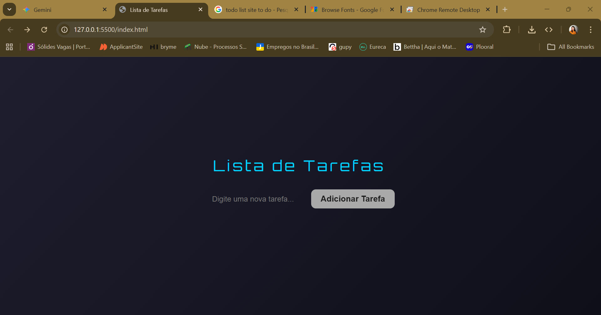

# Task List Pro - Dark Glass Edition

Uma lista de tarefas moderna e responsiva desenvolvida com **HTML5**, **CSS3** (Glassmorphism) e **JavaScript Puro**. O projeto conta com persistência de dados no navegador e um visual futurista.

## Demonstração
 

## Funcionalidades
- **CRUD Completo**: Adicione, visualize, marque como concluída e exclua tarefas.
- **Persistência Local**: Suas tarefas ficam salvas no `localStorage`, não somem ao atualizar a página (F5).
- **Interface Futurista**: Design baseado em *Glassmorphism* com tema escuro e efeitos neon.
- **Animação Typewriter**: Título com efeito de máquina de escrever ao carregar a página.
- **Totalmente Responsivo**: Layout adaptado para celulares e desktops via Media Queries.

## Tecnologias Utilizadas
- [HTML5](https://developer.mozilla.org/pt-BR/docs/Web/HTML)
- [CSS3](https://developer.mozilla.org/pt-BR/docs/Web/CSS) (Flexbox, Keyframes, Media Queries)
- [JavaScript](https://developer.mozilla.org/pt-BR/docs/Web/JavaScript) (DOM, LocalStorage, JSON)
- [Google Fonts](https://fonts.google.com/) (Orbitron & Inter)

